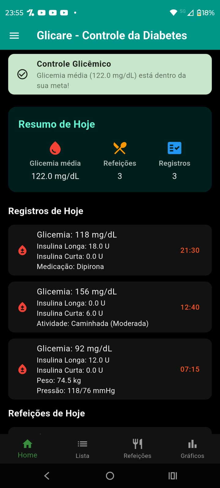
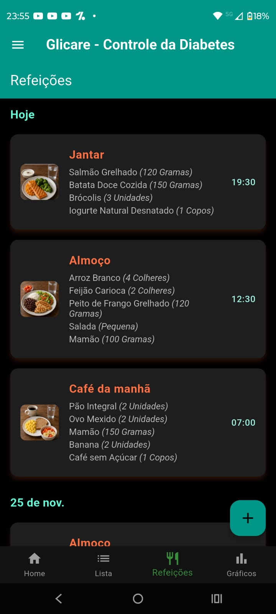
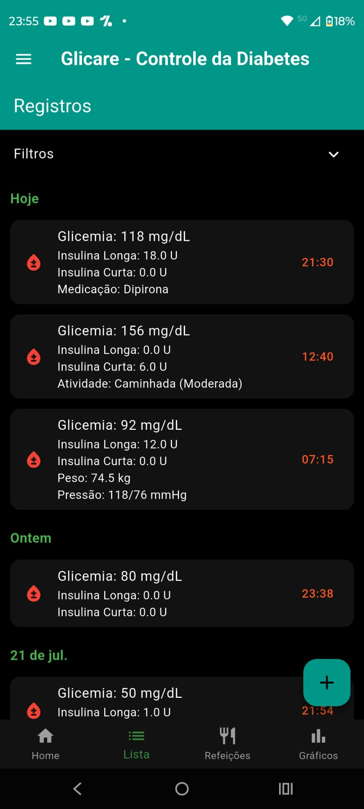
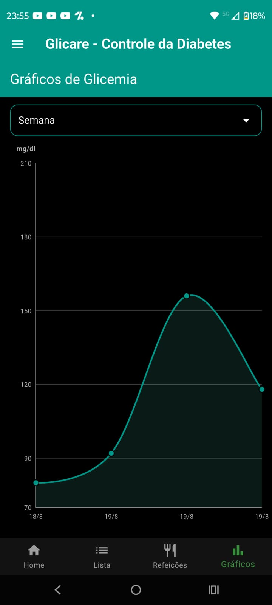

# 💧 Glicare

O **Glicare** é um aplicativo desenvolvido em **Flutter** com o objetivo de auxiliar pessoas com diabetes no acompanhamento e organização de informações relacionadas à sua rotina de cuidados.

A aplicação permite registrar dados como **glicemia, insulina, pressão arterial, medicamentos e refeições**, além de disponibilizar filtros e gráficos para facilitar o acompanhamento da variação glicêmica ao longo do tempo.

---

## ✨ Funcionalidades

### 📊 Controle de saúde

* Registro de **glicemia**.
* Registro de **insulina**.
* Registro de **pressão arterial**.
* Histórico completo dos registros realizados.
* Visualização dos dados de forma organizada.

### 💊 Gerenciamento de medicamentos

* Cadastro de medicamentos.
* Informações de **nome, dosagem e unidade**.
* Definição de **frequência de uso**.
* Definição da **duração do tratamento**.
* Acompanhamento dos medicamentos cadastrados.

### 🍽️ Registro de refeições

* Cadastro de refeições por tipo.
* Registro dos alimentos consumidos.
* Informações de porção.
* Possibilidade de adicionar **imagem à refeição**.
* Visualização dos registros posteriormente.

### 🔎 Filtros e histórico

* Filtragem de registros por **período**.
* Filtro por **medicamentos**.
* Filtro por **intervalo de glicemia**.
* Consulta ao histórico dos registros realizados.

### 📈 Gráficos e acompanhamento

* Visualização da variação da glicemia.
* Gráficos organizados por:

  * Dia
  * Semana
  * Mês
* Facilita a identificação de variações e padrões nos registros.

---

## 🛠️ Tecnologias utilizadas

| Tecnologia           | Utilização                                   |
| -------------------- | -------------------------------------------- |
| **Flutter**          | Desenvolvimento da aplicação multiplataforma |
| **Dart**             | Linguagem de programação                     |
| **SQLite / sqflite** | Persistência e armazenamento local dos dados |

---

## 📱 Demonstração

Algumas telas do aplicativo:

### 🏠 Tela inicial

<p align="center">
  
</p>

### 🍽️ Refeições

<p align="center">
  
</p>

### 💊 Registros

<p align="center">
  
</p>

### 📊 Gráficos

<p align="center">
  
</p>

<p align="center">
  
  
  
  
</p>
---

## 🚀 Como executar

### Pré-requisitos

Antes de executar o projeto, certifique-se de possuir:

* [Flutter SDK](https://docs.flutter.dev/get-started/install)
* **Android Studio** ou **Visual Studio Code**
* **Emulador Android** ou um dispositivo físico
* Git instalado

Também é recomendado verificar se o ambiente Flutter está configurado corretamente:

```bash
flutter doctor
```

---

### 📥 Instalação

Clone o repositório:

```bash
git clone https://github.com/AntonioCoelho19/Glicare.git
```

Entre na pasta do projeto:

```bash
cd Glicare
```

Instale as dependências:

```bash
flutter pub get
```

Verifique os dispositivos disponíveis:

```bash
flutter devices
```

Execute o aplicativo:

```bash
flutter run
```

---
